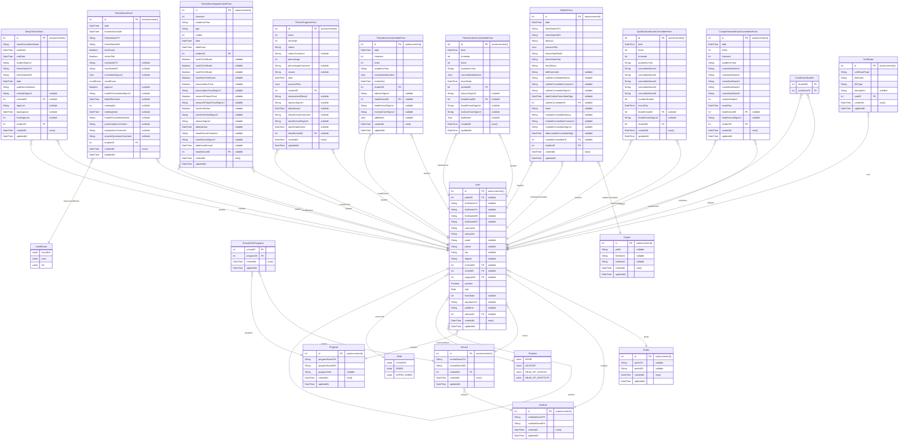

```mermaid
erDiagram
	Position {
		value NONE
		value ADVISOR
		value HEAD_OF_SCHOOL
		value HEAD_OF_INSTITUTE
	}
	Role {
		value STUDENT
		value ADMIN
		value SUPER_ADMIN
	}
	resultExam {
		value excellent
		value pass
		value fail
	}
	Institute {
		Int id PK  "autoincrement()"
		String instituteNameTH
		String instituteNameEN
		DateTime createdAt  "now()"
		DateTime updatedAt
	}
	School {
		Int id PK  "autoincrement()"
		String schoolNameTH
		String schoolNameEN
		Int instituteID FK
		DateTime createdAt  "now()"
		DateTime updatedAt
	}
	Program {
		Int id PK  "autoincrement()"
		String programNameTH
		String programNameEN
		String programYear  "nullable"
		DateTime createdAt  "now()"
		DateTime updatedAt
	}
	SchoolsOnPrograms {
		Int schoolID FK
		Int programID FK
		DateTime createdAt  "now()"
		DateTime updatedAt
	}
	Prefix {
		Int id PK  "autoincrement()"
		String prefixTH  "nullable"
		String prefixEN  "nullable"
		DateTime createdAt  "now()"
		DateTime updatedAt
	}
	Expert {
		Int id PK  "autoincrement()"
		String prefix  "nullable"
		String firstName  "nullable"
		String lastName  "nullable"
		DateTime createdAt  "now()"
		DateTime updatedAt
	}
	Certificate {
		Int id PK  "autoincrement()"
		String certificateType
		String fileName
		String fileType
		String description  "nullable"
		Int userID FK
		DateTime createdAt  "now()"
		DateTime updatedAt
	}
	User {
		Int id PK  "autoincrement()"
		Int prefixID FK  "nullable"
		String firstNameTH  "nullable"
		String lastNameTH  "nullable"
		String firstNameEN  "nullable"
		String lastNameEN  "nullable"
		String username
		String password
		String email  "nullable"
		String phone  "nullable"
		String sex  "nullable"
		String degree  "nullable"
		Int instituteID FK  "nullable"
		Int schoolID FK  "nullable"
		Int programID FK  "nullable"
		Position position
		Role role
		Int formState  "nullable"
		String signatureUrl  "nullable"
		String profileUrl  "nullable"
		Int advisorID FK  "nullable"
		DateTime createdAt  "now()"
		DateTime updatedAt
	}
	CoAdvisorStudent {
		Int studentID FK
		Int coAdvisorID FK
	}
	ComprehensiveExamCommitteeForm {
		Int id PK  "autoincrement()"
		DateTime date
		Int times
		Int trimester
		String academicYear
		String committeeName1
		String committeeName2
		String committeeName3
		String committeeName4
		String committeeName5
		Int numberStudent
		DateTime examDay
		Int headSchoolID FK  "nullable"
		String headSchoolSignUrl  "nullable"
		Int studentID FK
		DateTime createdAt  "now()"
		DateTime updatedAt
	}
	QualificationExamCommitteeForm {
		Int id PK  "autoincrement()"
		DateTime date
		Int times
		Int trimester
		String academicYear
		String committeeName1
		String committeeName2
		String committeeName3
		String committeeName4
		String committeeName5
		Int numberStudent
		DateTime examDay
		Int headSchoolID FK  "nullable"
		String headSchoolSignUrl  "nullable"
		Int studentID FK
		DateTime createdAt  "now()"
		DateTime updatedAt
	}
	ThesisOutlineCommitteeForm {
		Int id PK  "autoincrement()"
		DateTime date
		Int trimester
		Int times
		String academicYear
		Json committeeMembers
		DateTime examDate
		Int studentID FK
		String advisorSignUrl  "nullable"
		Int headSchoolID FK  "nullable"
		String headSchoolSignUrl  "nullable"
		String instituteComSignUrl  "nullable"
		Json addNotes  "nullable"
		DateTime createdAt  "now()"
		DateTime updatedAt
	}
	ThesisExamCommitteeForm {
		Int id PK  "autoincrement()"
		DateTime date
		Int trimester
		Int times
		String academicYear
		Json committeeMembers
		DateTime examDate
		Int studentID FK
		String advisorSignUrl  "nullable"
		Int headSchoolID FK  "nullable"
		String headSchoolSignUrl  "nullable"
		String instituteComSignUrl  "nullable"
		Json addNotes  "nullable"
		DateTime createdAt  "now()"
		DateTime updatedAt
	}
	OutlineForm {
		Int id PK  "autoincrement()"
		DateTime date
		String thesisNameTH
		String thesisNameEN
		String abstract
		Json processPlan
		String thesisStartMonth
		String thesisStartYear
		String formStatus
		String editComment  "nullable"
		String outlineCommitteeStatus  "nullable"
		String outlineCommitteeComment  "nullable"
		String outlineCommitteeSignUrl  "nullable"
		DateTime dateOutlineCommitteeSign  "nullable"
		Int outlineCommitteeID FK  "nullable"
		String times  "nullable"
		String instituteCommitteeStatus  "nullable"
		String instituteCommitteeComment  "nullable"
		String instituteCommitteeSignUrl  "nullable"
		DateTime dateInstituteCommitteeSign  "nullable"
		Int instituteCommitteeID FK  "nullable"
		Int studentID FK
		DateTime createdAt  "now()"
		DateTime updatedAt
	}
	ThesisProgressForm {
		Int id PK  "autoincrement()"
		Int times
		Int trimester
		String status
		String statusComment  "nullable"
		Int percentage
		String percentageComment  "nullable"
		String issues  "nullable"
		DateTime date
		Json processPlan
		Int studentID FK
		String assessmentResult  "nullable"
		String advisorSignUrl  "nullable"
		DateTime dateAdvisor  "nullable"
		String headSchoolComment  "nullable"
		String headSchoolSignUrl  "nullable"
		DateTime dateHeadSchool  "nullable"
		Int headSchoolID FK  "nullable"
		DateTime createdAt  "now()"
		DateTime updatedAt
	}
	ThesisExamAppointmentForm {
		Int id PK  "autoincrement()"
		Int trimester
		String academicYear
		String gpa
		Int credits
		DateTime date
		DateTime dateExam
		Int studentID FK
		Boolean has01Certificate  "nullable"
		Boolean has02Certificate  "nullable"
		Boolean has03Certificate  "nullable"
		Boolean hasOtherCertificate  "nullable"
		Boolean presentationFund  "nullable"
		String presentationFundSignUrl  "nullable"
		Boolean researchProjectFund  "nullable"
		String researchProjectFundSignUrl  "nullable"
		Boolean turnitinVerified  "nullable"
		String turnitinVerifiedSignUrl  "nullable"
		String advisorSignUrl  "nullable"
		DateTime dateAdvisor  "nullable"
		String headSchoolComment  "nullable"
		String headSchoolSignUrl  "nullable"
		DateTime dateHeadSchool  "nullable"
		Int headSchoolID FK  "nullable"
		DateTime createdAt  "now()"
		DateTime updatedAt
	}
	ThesisExamForm {
		Int id PK  "autoincrement()"
		DateTime date
		DateTime examinationDate
		String thesisNameTH
		String thesisNameEN
		Boolean disClosed
		Boolean reviseTitle
		String newNameTH  "nullable"
		String newNameEN  "nullable"
		Json committeeSignUrl  "nullable"
		resultExam resultExam
		Boolean approve  "nullable"
		String headOfCommitteeSignUrl  "nullable"
		DateTime dateOfDecision  "nullable"
		Int meetingNo  "nullable"
		DateTime meetingDate  "nullable"
		String headOfCommitteeName  "nullable"
		String presentationComment  "nullable"
		String explanationComment  "nullable"
		String answerQuestionsCooment  "nullable"
		Int studentID FK
		DateTime createdAt  "now()"
		DateTime updatedAt
	}
	DelayThesisForm {
		Int id PK  "autoincrement()"
		String headCommitteeName
		DateTime startDate
		DateTime endDate
		String studentSignUrl
		String thesisNameTH
		String thesisNameEN
		DateTime date
		String publishmentName
		String instituteSignUrl  "nullable"
		Int instituteID FK  "nullable"
		String approve  "nullable"
		DateTime dayApprove  "nullable"
		Int timeApprove  "nullable"
		Int studentID FK
		DateTime createdAt  "now()"
		DateTime updatedAt
	}
	School }o--|| Institute : institute
	SchoolsOnPrograms }o--|| School : school
	SchoolsOnPrograms }o--|| Program : program
	Certificate }o--|| User : user
	User }o--|| Prefix : prefix
	User }o--|| Institute : institute
	User }o--|| School : school
	User }o--|| Program : program
	User }o--|| User : advisor
	User }o--|| Position : "enum:position"
	User }o--|| Role : "enum:role"
	CoAdvisorStudent }o--|| User : student
	CoAdvisorStudent }o--|| User : coAdvisor
	ComprehensiveExamCommitteeForm }o--|| User : headSchool
	ComprehensiveExamCommitteeForm }o--|| User : student
	QualificationExamCommitteeForm }o--|| User : headSchool
	QualificationExamCommitteeForm }o--|| User : student
	ThesisOutlineCommitteeForm }o--|| User : student
	ThesisOutlineCommitteeForm }o--|| User : headSchool
	ThesisExamCommitteeForm }o--|| User : student
	ThesisExamCommitteeForm }o--|| User : headSchool
	OutlineForm }o--|| Expert : outlineCommittee
	OutlineForm }o--|| User : instituteCommittee
	OutlineForm }o--|| User : student
	ThesisProgressForm }o--|| User : student
	ThesisProgressForm }o--|| User : headSchool
	ThesisExamAppointmentForm }o--|| User : student
	ThesisExamAppointmentForm }o--|| User : headSchool
	ThesisExamForm }o--|| User : student
	ThesisExamForm }o--|| resultExam : "enum:resultExam"
	DelayThesisForm }o--|| User : institute
	DelayThesisForm }o--|| User : student

```
