- [default](#default)

## default

```mermaid
erDiagram
"Institute" {
  Int id PK
  String instituteNameTH
  String instituteNameEN
  DateTime createdAt
  DateTime updatedAt
}
"School" {
  Int id PK
  String schoolNameTH
  String schoolNameEN
  Int instituteID FK
  DateTime createdAt
  DateTime updatedAt
}
"Program" {
  Int id PK
  String programNameTH
  String programNameEN
  String programYear "nullable"
  DateTime createdAt
  DateTime updatedAt
}
"SchoolsOnPrograms" {
  Int schoolID FK
  Int programID FK
  DateTime createdAt
  DateTime updatedAt
}
"Prefix" {
  Int id PK
  String prefixTH "nullable"
  String prefixEN "nullable"
  DateTime createdAt
  DateTime updatedAt
}
"Expert" {
  Int id PK
  String prefix "nullable"
  String firstName "nullable"
  String lastName "nullable"
  DateTime createdAt
  DateTime updatedAt
}
"Certificate" {
  Int id PK
  String certificateType
  String fileName
  String fileType
  String description "nullable"
  Int userID FK
  DateTime createdAt
  DateTime updatedAt
}
"User" {
  Int id PK
  Int prefixID FK "nullable"
  String firstNameTH "nullable"
  String lastNameTH "nullable"
  String firstNameEN "nullable"
  String lastNameEN "nullable"
  String username UK
  String password
  String email UK "nullable"
  String phone "nullable"
  String sex "nullable"
  String degree "nullable"
  Int instituteID FK "nullable"
  Int schoolID FK "nullable"
  Int programID FK "nullable"
  Position position
  Role role
  Int formState "nullable"
  String signatureUrl "nullable"
  String profileUrl "nullable"
  Int advisorID FK "nullable"
  DateTime createdAt
  DateTime updatedAt
}
"CoAdvisorStudent" {
  Int studentID FK
  Int coAdvisorID FK
}
"ComprehensiveExamCommitteeForm" {
  Int id PK
  DateTime date
  Int times
  Int trimester
  String academicYear
  String committeeName1
  String committeeName2
  String committeeName3
  String committeeName4
  String committeeName5
  Int numberStudent
  DateTime examDay
  Int headSchoolID FK "nullable"
  String headSchoolSignUrl "nullable"
  Int studentID FK
  DateTime createdAt
  DateTime updatedAt
}
"QualificationExamCommitteeForm" {
  Int id PK
  DateTime date
  Int times
  Int trimester
  String academicYear
  String committeeName1
  String committeeName2
  String committeeName3
  String committeeName4
  String committeeName5
  Int numberStudent
  DateTime examDay
  Int headSchoolID FK "nullable"
  String headSchoolSignUrl "nullable"
  Int studentID FK
  DateTime createdAt
  DateTime updatedAt
}
"ThesisOutlineCommitteeForm" {
  Int id PK
  DateTime date
  Int trimester
  Int times
  String academicYear
  Json committeeMembers
  DateTime examDate
  Int studentID FK
  String advisorSignUrl "nullable"
  Int headSchoolID FK "nullable"
  String headSchoolSignUrl "nullable"
  String instituteComSignUrl "nullable"
  Json addNotes "nullable"
  DateTime createdAt
  DateTime updatedAt
}
"ThesisExamCommitteeForm" {
  Int id PK
  DateTime date
  Int trimester
  Int times
  String academicYear
  Json committeeMembers
  DateTime examDate
  Int studentID FK
  String advisorSignUrl "nullable"
  Int headSchoolID FK "nullable"
  String headSchoolSignUrl "nullable"
  String instituteComSignUrl "nullable"
  Json addNotes "nullable"
  DateTime createdAt
  DateTime updatedAt
}
"OutlineForm" {
  Int id PK
  DateTime date
  String thesisNameTH
  String thesisNameEN
  String abstract
  Json processPlan
  String thesisStartMonth
  String thesisStartYear
  String formStatus
  String editComment "nullable"
  String outlineCommitteeStatus "nullable"
  String outlineCommitteeComment "nullable"
  String outlineCommitteeSignUrl "nullable"
  DateTime dateOutlineCommitteeSign "nullable"
  Int outlineCommitteeID FK "nullable"
  String times "nullable"
  String instituteCommitteeStatus "nullable"
  String instituteCommitteeComment "nullable"
  String instituteCommitteeSignUrl "nullable"
  DateTime dateInstituteCommitteeSign "nullable"
  Int instituteCommitteeID FK "nullable"
  Int studentID FK
  DateTime createdAt
  DateTime updatedAt
}
"ThesisProgressForm" {
  Int id PK
  Int times
  Int trimester
  String status
  String statusComment "nullable"
  Int percentage
  String percentageComment "nullable"
  String issues "nullable"
  DateTime date
  Json processPlan
  Int studentID FK
  String assessmentResult "nullable"
  String advisorSignUrl "nullable"
  DateTime dateAdvisor "nullable"
  String headSchoolComment "nullable"
  String headSchoolSignUrl "nullable"
  DateTime dateHeadSchool "nullable"
  Int headSchoolID FK "nullable"
  DateTime createdAt
  DateTime updatedAt
}
"ThesisExamAppointmentForm" {
  Int id PK
  Int trimester
  String academicYear
  String gpa
  Int credits
  DateTime date
  DateTime dateExam
  Int studentID FK
  Boolean has01Certificate "nullable"
  Boolean has02Certificate "nullable"
  Boolean has03Certificate "nullable"
  Boolean hasOtherCertificate "nullable"
  Boolean presentationFund "nullable"
  String presentationFundSignUrl "nullable"
  Boolean researchProjectFund "nullable"
  String researchProjectFundSignUrl "nullable"
  Boolean turnitinVerified "nullable"
  String turnitinVerifiedSignUrl "nullable"
  String advisorSignUrl "nullable"
  DateTime dateAdvisor "nullable"
  String headSchoolComment "nullable"
  String headSchoolSignUrl "nullable"
  DateTime dateHeadSchool "nullable"
  Int headSchoolID FK "nullable"
  DateTime createdAt
  DateTime updatedAt
}
"ThesisExamForm" {
  Int id PK
  DateTime date
  DateTime examinationDate
  String thesisNameTH
  String thesisNameEN
  Boolean disClosed
  Boolean reviseTitle
  String newNameTH "nullable"
  String newNameEN "nullable"
  Json committeeSignUrl "nullable"
  resultExam resultExam "nullable"
  Boolean approve "nullable"
  String headOfCommitteeSignUrl "nullable"
  DateTime dateOfDecision "nullable"
  Int meetingNo "nullable"
  DateTime meetingDate "nullable"
  String headOfCommitteeName "nullable"
  String presentationComment "nullable"
  String explanationComment "nullable"
  String answerQuestionsCooment "nullable"
  Int studentID FK
  DateTime createdAt
  DateTime updatedAt
}
"DelayThesisForm" {
  Int id PK
  String headCommitteeName
  DateTime startDate
  DateTime endDate
  String studentSignUrl
  String thesisNameTH
  String thesisNameEN
  DateTime date
  String publishmentName
  String instituteSignUrl "nullable"
  Int instituteID FK "nullable"
  String approve "nullable"
  DateTime dayApprove "nullable"
  Int timeApprove "nullable"
  Int studentID FK
  DateTime createdAt
  DateTime updatedAt
}
"School" }o--|| "Institute" : institute
"SchoolsOnPrograms" }o--|| "School" : school
"SchoolsOnPrograms" }o--|| "Program" : program
"Certificate" }o--|| "User" : user
"User" }o--o| "Prefix" : prefix
"User" }o--o| "Institute" : institute
"User" }o--o| "School" : school
"User" }o--o| "Program" : program
"User" }o--o| "User" : advisor
"CoAdvisorStudent" }o--|| "User" : student
"CoAdvisorStudent" }o--|| "User" : coAdvisor
"ComprehensiveExamCommitteeForm" }o--o| "User" : headSchool
"ComprehensiveExamCommitteeForm" }o--|| "User" : student
"QualificationExamCommitteeForm" }o--o| "User" : headSchool
"QualificationExamCommitteeForm" }o--|| "User" : student
"ThesisOutlineCommitteeForm" }o--|| "User" : student
"ThesisOutlineCommitteeForm" }o--o| "User" : headSchool
"ThesisExamCommitteeForm" }o--|| "User" : student
"ThesisExamCommitteeForm" }o--o| "User" : headSchool
"OutlineForm" }o--o| "Expert" : outlineCommittee
"OutlineForm" }o--o| "User" : instituteCommittee
"OutlineForm" }o--|| "User" : student
"ThesisProgressForm" }o--|| "User" : student
"ThesisProgressForm" }o--o| "User" : headSchool
"ThesisExamAppointmentForm" }o--|| "User" : student
"ThesisExamAppointmentForm" }o--o| "User" : headSchool
"ThesisExamForm" }o--|| "User" : student
"DelayThesisForm" }o--o| "User" : institute
"DelayThesisForm" }o--|| "User" : student
```

### `Institute`

**Properties**
  - `id`: 
  - `instituteNameTH`: 
  - `instituteNameEN`: 
  - `createdAt`: 
  - `updatedAt`: 

### `School`

**Properties**
  - `id`: 
  - `schoolNameTH`: 
  - `schoolNameEN`: 
  - `instituteID`: 
  - `createdAt`: 
  - `updatedAt`: 

### `Program`

**Properties**
  - `id`: 
  - `programNameTH`: 
  - `programNameEN`: 
  - `programYear`: 
  - `createdAt`: 
  - `updatedAt`: 

### `SchoolsOnPrograms`

**Properties**
  - `schoolID`: 
  - `programID`: 
  - `createdAt`: 
  - `updatedAt`: 

### `Prefix`

**Properties**
  - `id`: 
  - `prefixTH`: 
  - `prefixEN`: 
  - `createdAt`: 
  - `updatedAt`: 

### `Expert`

**Properties**
  - `id`: 
  - `prefix`: 
  - `firstName`: 
  - `lastName`: 
  - `createdAt`: 
  - `updatedAt`: 

### `Certificate`

**Properties**
  - `id`: 
  - `certificateType`: 
  - `fileName`: 
  - `fileType`: 
  - `description`: 
  - `userID`: 
  - `createdAt`: 
  - `updatedAt`: 

### `User`

**Properties**
  - `id`: 
  - `prefixID`: 
  - `firstNameTH`: 
  - `lastNameTH`: 
  - `firstNameEN`: 
  - `lastNameEN`: 
  - `username`: 
  - `password`: 
  - `email`: 
  - `phone`: 
  - `sex`: 
  - `degree`: 
  - `instituteID`: 
  - `schoolID`: 
  - `programID`: 
  - `position`: 
  - `role`: 
  - `formState`: 
  - `signatureUrl`: 
  - `profileUrl`: 
  - `advisorID`: 
  - `createdAt`: 
  - `updatedAt`: 

### `CoAdvisorStudent`

**Properties**
  - `studentID`: 
  - `coAdvisorID`: 

### `ComprehensiveExamCommitteeForm`

**Properties**
  - `id`: 
  - `date`: 
  - `times`: 
  - `trimester`: 
  - `academicYear`: 
  - `committeeName1`: 
  - `committeeName2`: 
  - `committeeName3`: 
  - `committeeName4`: 
  - `committeeName5`: 
  - `numberStudent`: 
  - `examDay`: 
  - `headSchoolID`: 
  - `headSchoolSignUrl`: 
  - `studentID`: 
  - `createdAt`: 
  - `updatedAt`: 

### `QualificationExamCommitteeForm`

**Properties**
  - `id`: 
  - `date`: 
  - `times`: 
  - `trimester`: 
  - `academicYear`: 
  - `committeeName1`: 
  - `committeeName2`: 
  - `committeeName3`: 
  - `committeeName4`: 
  - `committeeName5`: 
  - `numberStudent`: 
  - `examDay`: 
  - `headSchoolID`: 
  - `headSchoolSignUrl`: 
  - `studentID`: 
  - `createdAt`: 
  - `updatedAt`: 

### `ThesisOutlineCommitteeForm`

**Properties**
  - `id`: 
  - `date`: 
  - `trimester`: 
  - `times`: 
  - `academicYear`: 
  - `committeeMembers`: 
  - `examDate`: 
  - `studentID`: 
  - `advisorSignUrl`: 
  - `headSchoolID`: 
  - `headSchoolSignUrl`: 
  - `instituteComSignUrl`: 
  - `addNotes`: 
  - `createdAt`: 
  - `updatedAt`: 

### `ThesisExamCommitteeForm`

**Properties**
  - `id`: 
  - `date`: 
  - `trimester`: 
  - `times`: 
  - `academicYear`: 
  - `committeeMembers`: 
  - `examDate`: 
  - `studentID`: 
  - `advisorSignUrl`: 
  - `headSchoolID`: 
  - `headSchoolSignUrl`: 
  - `instituteComSignUrl`: 
  - `addNotes`: 
  - `createdAt`: 
  - `updatedAt`: 

### `OutlineForm`

**Properties**
  - `id`: 
  - `date`: 
  - `thesisNameTH`: 
  - `thesisNameEN`: 
  - `abstract`: 
  - `processPlan`: 
  - `thesisStartMonth`: 
  - `thesisStartYear`: 
  - `formStatus`: 
  - `editComment`: 
  - `outlineCommitteeStatus`: 
  - `outlineCommitteeComment`: 
  - `outlineCommitteeSignUrl`: 
  - `dateOutlineCommitteeSign`: 
  - `outlineCommitteeID`: 
  - `times`: 
  - `instituteCommitteeStatus`: 
  - `instituteCommitteeComment`: 
  - `instituteCommitteeSignUrl`: 
  - `dateInstituteCommitteeSign`: 
  - `instituteCommitteeID`: 
  - `studentID`: 
  - `createdAt`: 
  - `updatedAt`: 

### `ThesisProgressForm`

**Properties**
  - `id`: 
  - `times`: 
  - `trimester`: 
  - `status`: 
  - `statusComment`: 
  - `percentage`: 
  - `percentageComment`: 
  - `issues`: 
  - `date`: 
  - `processPlan`: 
  - `studentID`: 
  - `assessmentResult`: 
  - `advisorSignUrl`: 
  - `dateAdvisor`: 
  - `headSchoolComment`: 
  - `headSchoolSignUrl`: 
  - `dateHeadSchool`: 
  - `headSchoolID`: 
  - `createdAt`: 
  - `updatedAt`: 

### `ThesisExamAppointmentForm`

**Properties**
  - `id`: 
  - `trimester`: 
  - `academicYear`: 
  - `gpa`: 
  - `credits`: 
  - `date`: 
  - `dateExam`: 
  - `studentID`: 
  - `has01Certificate`: 
  - `has02Certificate`: 
  - `has03Certificate`: 
  - `hasOtherCertificate`: 
  - `presentationFund`: 
  - `presentationFundSignUrl`: 
  - `researchProjectFund`: 
  - `researchProjectFundSignUrl`: 
  - `turnitinVerified`: 
  - `turnitinVerifiedSignUrl`: 
  - `advisorSignUrl`: 
  - `dateAdvisor`: 
  - `headSchoolComment`: 
  - `headSchoolSignUrl`: 
  - `dateHeadSchool`: 
  - `headSchoolID`: 
  - `createdAt`: 
  - `updatedAt`: 

### `ThesisExamForm`

**Properties**
  - `id`: 
  - `date`: 
  - `examinationDate`: 
  - `thesisNameTH`: 
  - `thesisNameEN`: 
  - `disClosed`: 
  - `reviseTitle`: 
  - `newNameTH`: 
  - `newNameEN`: 
  - `committeeSignUrl`: 
  - `resultExam`: 
  - `approve`: 
  - `headOfCommitteeSignUrl`: 
  - `dateOfDecision`: 
  - `meetingNo`: 
  - `meetingDate`: 
  - `headOfCommitteeName`: 
  - `presentationComment`: 
  - `explanationComment`: 
  - `answerQuestionsCooment`: 
  - `studentID`: 
  - `createdAt`: 
  - `updatedAt`: 

### `DelayThesisForm`

**Properties**
  - `id`: 
  - `headCommitteeName`: 
  - `startDate`: 
  - `endDate`: 
  - `studentSignUrl`: 
  - `thesisNameTH`: 
  - `thesisNameEN`: 
  - `date`: 
  - `publishmentName`: 
  - `instituteSignUrl`: 
  - `instituteID`: 
  - `approve`: 
  - `dayApprove`: 
  - `timeApprove`: 
  - `studentID`: 
  - `createdAt`: 
  - `updatedAt`: 